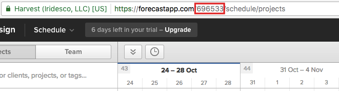

# forecastapp.com API PHP
Simple API client for forecastapp.com

    $forecastAPI = new \pro\data5\ForecastAppAPI('testmail@gmail.com', 'mylongpass', '123479');
    $usersList = $forecastAPI->people();
    var_dump($usersList);

    

App ID is in your URL

Please star if it was helpful. You can hire author [on Upwork](https://www.upwork.com/freelancers/~0110e79b44736be7ab).

(c) [Solokhin Ilya](http://data5.pro)